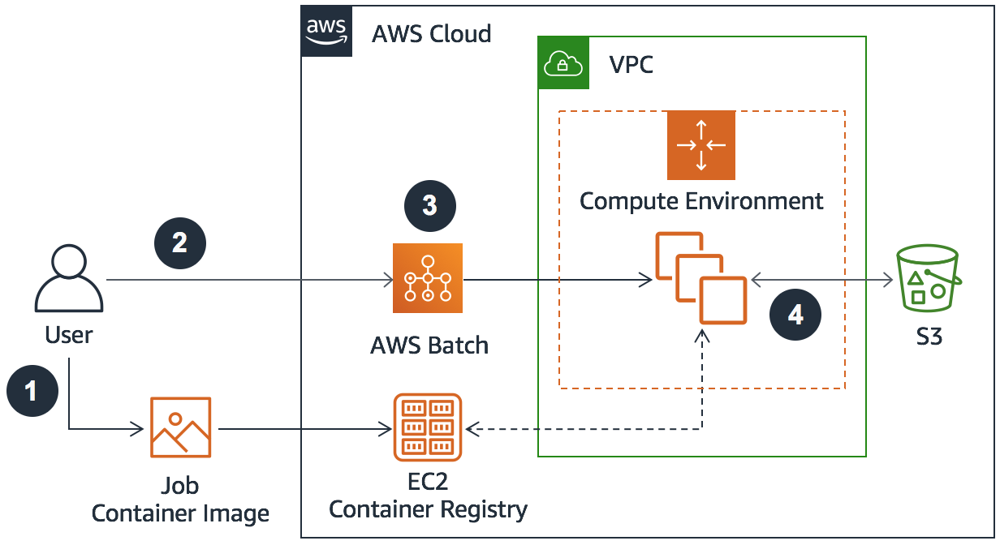
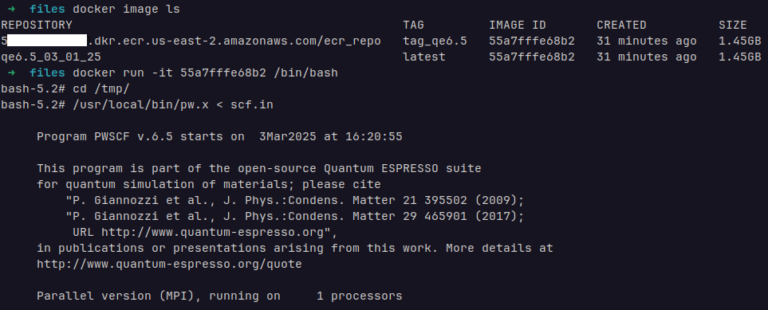
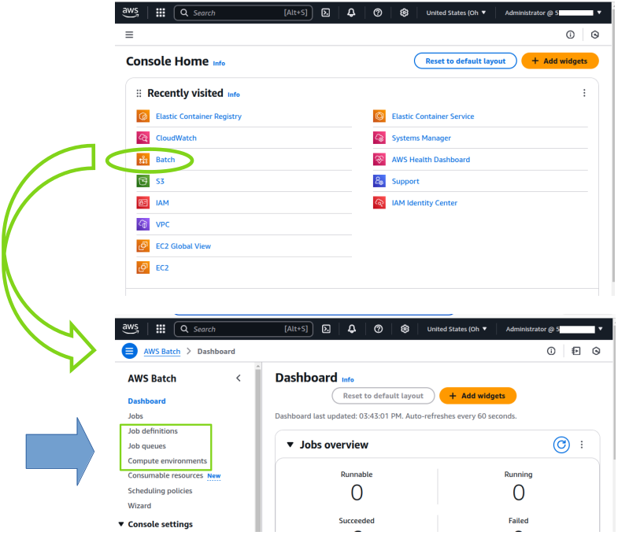
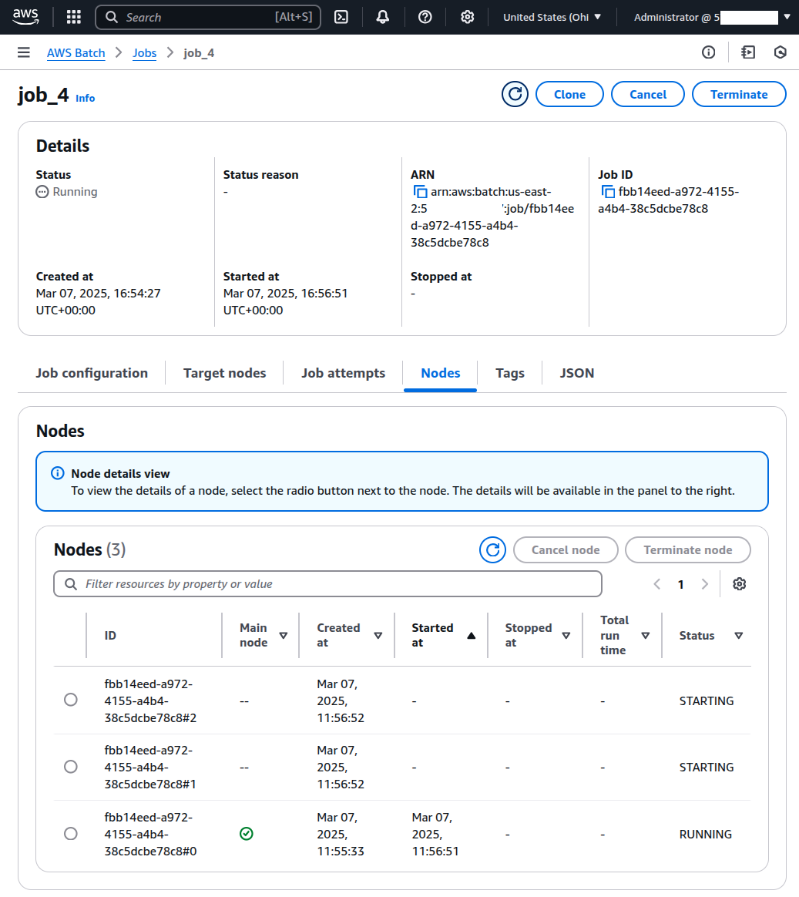
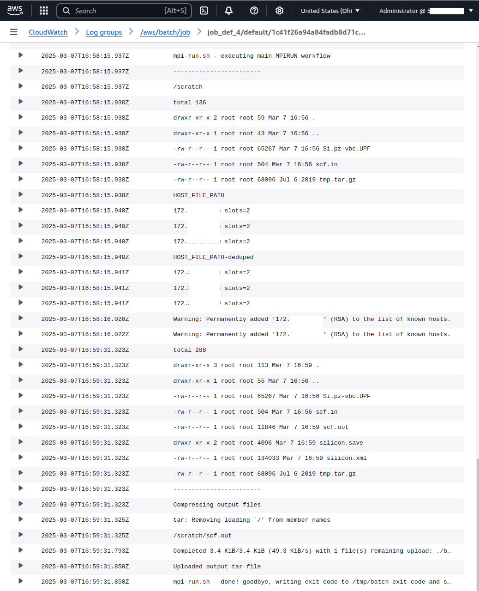
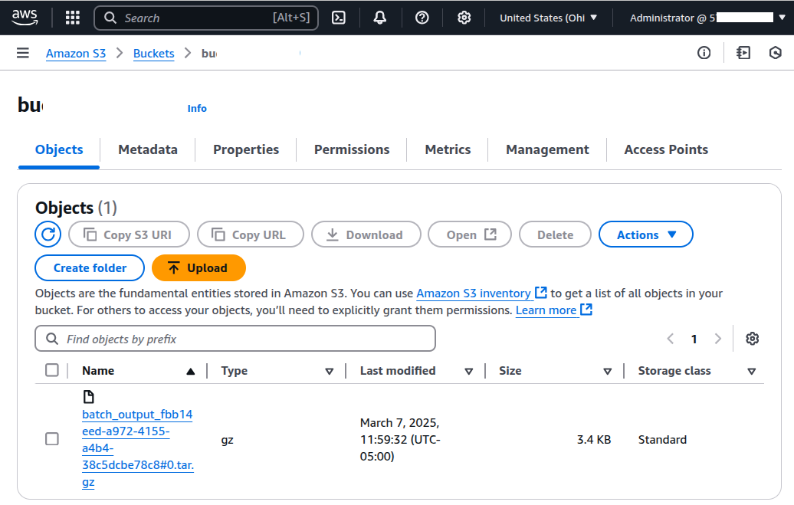
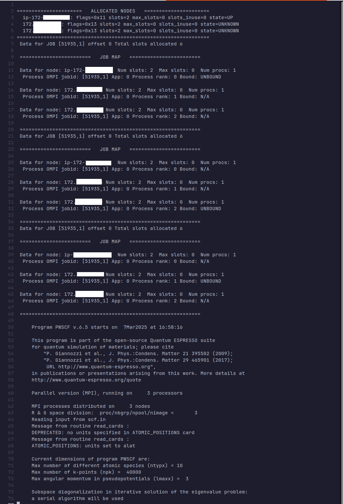

# Calculating quantum materials on the cloud

<p align="center">

</p>

This tutorial explains how to run Quantum Espresso simulations on the cloud, leveraging on-demand hardware resources for more complex simulations.

Traditionally, these simulations are run on private or governmental supercomputing clusters. Users submit an input script to a queue scheduler (e.g. PBS, Slurm); the input script includes the commands to start the simulation (e.g. `mpirun -np 100 myjob.exe`). The job then waits in the queue until the requested hardware resources are allocated.

Amazon offers a paid service, `AWS Batch`, which allows users to request on-demand servers (nodes) and launch jobs on them. This service is designed to provision resources for large-scale parallel computing jobs. 

<p align="center">

</p>
<p align="center">
<p align="center"><sup>
https://docs.aws.amazon.com/wellarchitected/latest/high-performance-computing-lens/batch-based-architecture.html
</sup></p>

The process in Amazon's cloud environment is similar to working with governmental supercomputers. First, the user submits a job (**2**) to `AWS Batch` (**3**). Once the requested hardware resources are allocated, Amazon assembles a temporary private computing cluster (**4**) to run the job.

However, there are differences: the user is responsible for setting up the hardware, communication between nodes, and the software environment. Unlike with traditional supercomputing clusters, you cannot simply provide a single executable command like `mpirun myjob.exe`. Instead, you must: 
  1. Create a Docker image containing all necessary software packages (binaries, libraries, etc) and push it to an online repository, such as the Amazon's elastic container registry (`ECR`). 
  2. Once the compute environment (**4**) is up and running, each computing node in the cluster pulls the Docker image and runs it.

  3. The user must define the tasks that the container launches, along with the logic to orquestrate the interaction between nodes. This logic must be specified in the `CMD` line (of Dockerfile) that points to the default executable script in the container.

  4. After all tasks are completed, the cluster is dissolved, and any data is lost. Therefore, the user is responsible for saving any desired results, such as copying the ouput to an `S3` bucket for persistent storage.
 
# Walkthrough:

## 1. Building a Docker container to run Quantum Espresso.
<details> 
<summary> Click to expand </summary>

To build a Docker image for Quantum Espresso, run the following commands. This builds the image based on the directives found in the `Dockerfile`, which is expected in the current directory.
```bash
cd build_container/
docker build -t qe6.5_03_01_25 . 
```
Next, tag the image and push it to Amazon's container repository. Before pushing, fetch your Amazon login credentials with the command below and pipe that information to Docker to associate your Docker client with Amazon's container repository.

```bash
aws ecr get-login-password --region us-east-2 | docker login --username AWS --password-stdin 5xxxxxxxxxxx.dkr.ecr.us-east-2.amazonaws.com
docker tag qe6.5_03_01_25 5xxxxxxxxxxx.dkr.ecr.us-east-2.amazonaws.com/ecr_repo:tag_qe6.5
docker push 5xxxxxxxxxxx.dkr.ecr.us-east-2.amazonaws.com/ecr_repo:tag_qe6.5
```

### Installing required dependencies 
Before building Quantum Espresso, install the necessary dependencies in the image:
  - A Fortran compiler (currently `yum` is installing gfortran version 11.4.1). 
  - The required mathematical libraries LAPACK, ScaLAPACK and FFTW.
  - A MPI library for parallel computing.

### Installing Quantum Espresso 
Afterward, install Quantum Expresso version 6.5. Note that Fortran compiler version 11.4.1 causes errors when compiling ScaLAPACK and Quantum Espresso (`Error: Type mismatch between actual argument at (1) and actual argument at (2)`). This can be resolved by downgrading to an older version of gfortran (version < 10) or, as seen below, by adding the flag `-fallow-argument-mismatch` to the Fortran compiler.

Here are the Dockerfile lines relevant to installing the necessary dependencies and Quantum Espresso:

#### build_container/Dockerfile
```bash
## LAPACK
RUN yum -y install wget tar gzip gcc gcc-gfortran make
RUN wget -O /tmp/lapack.tar.gz http://www.netlib.org/lapack/lapack-3.8.0.tar.gz
RUN tar -xvf /tmp/lapack.tar.gz -C /tmp
RUN cd /tmp/lapack-3.8.0 && cp make.inc.example make.inc && make blaslib && make cblaslib && \
    make lib && cp libcblas.a liblapack.a librefblas.a libtmglib.a /usr/local/lib/

## OPENMPI
RUN yum -y install openmpi openmpi-devel
ENV PATH $PATH:/usr/lib64/openmpi/bin
ENV LD_LIBRARY_PATH $LD_LIBRARY_PATH:/usr/local/lib/:/usr/lib64/openmpi/lib

## SCALAPACK
RUN wget -O /tmp/scalapack.tgz http://www.netlib.org/scalapack/scalapack-2.0.2.tgz
RUN tar -xvf /tmp/scalapack.tgz -C /tmp
RUN cd /tmp/scalapack-2.0.2 && cp SLmake.inc.example SLmake.inc && \
    sed -i 's/FCFLAGS       = -O3/FCFLAGS       = -O3 -fallow-argument-mismatch/g' SLmake.inc && \
    make lib && cp libscalapack.a /usr/local/lib

## FFTW 
RUN wget -O /tmp/fftw.tar.gz http://www.fftw.org/fftw-3.3.8.tar.gz
RUN tar -xvf /tmp/fftw.tar.gz -C /tmp
RUN cd /tmp/fftw-3.3.8 && ./configure --prefix=/usr/local && make all && make install

## QE 6.5
RUN wget -O /tmp/q-e.tar.gz https://github.com/QEF/q-e/archive/qe-6.5.tar.gz
RUN tar -xvf /tmp/q-e.tar.gz -C /tmp
RUN cd /tmp/q-e-qe-6.5 && \
    ./configure --prefix=/usr/local/ BLAS_LIBS="-L/usr/local/lib -lrefblas" && \
    sed -i 's/FFLAGS         = -O3 -g/FFLAGS         = -O3 -g -fallow-argument-mismatch/g' make.inc && \
    make pw && make install
```
</details> 


## 2. Local testing of the Quantum Espresso container.
<details> 
<summary> Click to expand </summary>

We have created a Docker image (ID 55a7fffe68b2) and pushed it to Amazon's container repository. When executing an `AWS Batch` job, each computing node launches a copy of the image, and the script specified by the `CMD` directive in the Dockerfile (`CMD /files/entry-point.sh`) is executed. Before deploying the container on Amazon servers, we first test it locally using the following command: 
```bash
docker run -it 55a7fffe68b2 /bin/bash
```
This command launches the Docker image in interactive mode and overrides de default container execution with the `/bin/bash` shell. Once inside the shell, we can navigate the filesystem and verify that the Quantum Espresso binary (`pw.x`) and its associated libraries are present inside the image. To manually test Quantum Espresso with a single processor, we run the following command:
```bash
/usr/local/bin/pw.x < /tmp/scf.in 
```
The output below shows Quantum Espresso correctly is running correctly on our instance.

<p align="center">

</p>

</details>


## 3. Creation of a MPI-ready cluster on the AWS cloud.

<details> 
<summary> Click to expand </summary>

Upon the start of our `AWS Batch` job, the requested nodes are allocated to build a private computing cluster (`compute environment` **4**) on which our tasks will. Amazon automatically spins up each node in the cluster to pull and launch the requested Docker image. Once the image is running, Amazon provides the infrastructure, but the user is responsible for orchestrating all subsequent steps needed to execute a parallel Quantum Espresso calculation. For example:

- Interconnect all the nodes in the private computing cluster via SSH.
- Provide the input file and execute the Quantum Espresso calculation.
- Save any desired output before terminating the cluster and disk resources.

Below are the relevant lines in the Dockerfile:

#### build_container/Dockerfile
```bash
...
RUN pip install supervisor 
ADD ./supervisord.conf /files/supervisord.conf
ADD ./mpi-run.sh /files/mpi-run.sh
ADD ./entry-point.sh /files/entry-point.sh
ADD ./scf.in /tmp/scf.in
ADD ./Si.pz-vbc.UPF /tmp/Si.pz-vbc.UPF

CMD /files/entry-point.sh
...
```

#### build_container/files/entry-point.sh
When the Docker container is launched, the script `entry-point.sh` is executed, which we have copied into the container. The script starts `supervisor` using the input file `supervisord.conf`, which in turn starts the SSH daemon (`sshd`) on each node, allowing inter-node communication. After that, it runs the script `mpi-run.sh`, as specified in `supervisord.conf`. 
```bash
...
supervisord -n -c "/files/supervisord.conf"
...
```
#### build_container/supervisord.conf
```bash
[supervisord]
...
[program:sshd]
command=/usr/sbin/sshd -D -f /root/.ssh/sshd_config -h /root/.ssh/ssh_host_rsa_key
...
[program:sychronize]
command=/files/mpi-run.sh
...
```

#### build_container/mpi-run.sh
The script `mpi-run.sh` organizes all allocated nodes into a cluster suitable for running MPI applications, choosing one to act as the master node and the others as child nodes. It uses the functions `report_to_master()` and `wait_for_nodes()` to synchronize all nodes. The master node writes the IP addresses of all nodes into a file `${HOST_FILE_PATH}-deduped` and launches the main task with the following command:

```bash
  ...
  /usr/lib64/openmpi/bin/mpirun --mca btl_tcp_if_include eth0 -np $MPI_THREADS  -N 1 \
                          -x PATH -x LD_LIBRARY_PATH -x OMP_NUM_THREADS \
                          --allow-run-as-root --machinefile ${HOST_FILE_PATH}-deduped \
                          --display-map --display-allocation \
                          /usr/local/bin/pw.x -inp scf.in > scf.out

  ...
```

Once the Quantum Espresso calculation is complete, we package any desired output files and the copy them to an `S3` non-volatile storage unit. Finally, the scripts terminates `supervisor`, completing all tasks within the container. The container then transitions to an "exited" state, and Amazon manages a successfull termination of the `AWS Batch` job.
```bash
  ...
  tar -czvf batch_output_$AWS_BATCH_JOB_ID.tar.gz $SCRATCH_DIR/*.out
  aws s3 cp batch_output_$AWS_BATCH_JOB_ID.tar.gz ${S3_OUTPUT}batch_output_$AWS_BATCH_JOB_ID.tar.gz  || echo Could not s3 cp 
  ...
  kill  $(cat /tmp/supervisord.pid)
  ...
```

</details>


## 4. Submission of the Quantum Espresso calculation as an `AWS Batch` job.

<details> 
<summary> Click to expand </summary>

The figure below shows a typical Amazon AWS console panel, highlighting the most common services offered. To submit an `AWS Batch` job, follow these steps using the `AWS Batch` GUI:. 

- Create a compute environment
- Create a job queue.
- Create a job definition.
- Submit a job.

<p align="center">

</p>
<p align="center">

These steps can be a bit tedious as they require configuring multiple Amazon services. Some of these configurations, however, only need to be done once when the AWS account is first set up. There are several tutorials available only to help you create this infrastructure, e.g. Footnotes <sup>[1](#footnote1)</sup>, <sup>[2](#footnote2)</sup>, and <sup>[3](#footnote3)</sup>.

### Programatic setup

If you prefer to automate the process, these steps can also be done programmatically by providing configuration details in JSON-formatted files. We provide examples of JSON files (`compute_env.json, job_queue.json, job_definition`) for reference. With these files, you can submit the job using the following commands:

1. Defining the AWS infrastructure
   ```bash
   #Use these commented lines if previous configurations need to be erased
   #aws batch update-compute-environment --compute-environment compute_env_4 --state DISABLED > erase.out
   #aws batch delete-compute-environment --compute-environment compute_env_4 
   #aws batch update-job-queue --job-queue job_queue_4 --state DISABLED > erase.out
   #aws batch delete-job-queue --job-queue job_queue_4
   #aws batch deregister-job-definition --job-definition job_def_4:1
   
   aws batch create-compute-environment --cli-input-json file://compute_env.json > compute_env.out
   aws batch create-job-queue --cli-input-json file://job_queue.json > job_queue.out 
   aws batch register-job-definition --cli-input-json file://job_definition.json > job_definition.out 
   ```

2. Submitting the `AWS Batch` job
   ```bash
   aws batch submit-job \
             --job-name job_4 \
             --job-queue job_queue_4 \
             --job-definition job_def_4:1
   ```

   Note: Be sure to replace the placeholders in the JSON files with your onw details, includeing:
   - subnets `subnet-2xxxxxxx, subnet-9xxxxxxx, subnet-exxxxxxx` (1 subnet is enough)
   - security group `sg-exxxxxxx`
   - Amazon user ID `5xxxxxxxxxxx`
   - S3 Bucket repository name `s3://bucket-xxxxxxxxx`
   - A job role with read/write permission to the S3 bucket: `MyRole-AWS-ECStask-S3FullAccesss`

Once submitted, you can monitor the job's status in the `AWS Batch` console. This MPI job utilizes 3 nodes (one per MPI process). Specific details about the nodes assigned to your job can be accessed through the console.
<p align="center">

</p>
<p align="center">

### Debugging and log access

For debugging purposes, you can view the output from each node in `CloudWatch`.
<p align="center">

</p>
<p align="center">

The logs for the master node indicate that the Quantum Espresso calculation finished sucessfully, and the output was compressed and uploaded to your S3 bucket.

<p align="center">

</p>

After downloading and unpacking the tar file from the S3 bucket, you can inspect the `scf.out` file, which contains the output from the Quantum Espresso calculation. This file confirms that the calculation was performed using 3 MPI processes.

<p align="center">

</p>

</details>

## References

<a name="footnote1">[1]</a>: https://www.youtube.com/watch?v=Ym9HWYFwFS8

<a name="footnote2">[2]</a>: https://www.youtube.com/watch?v=qPU9FzuAKIw

<a name="footnote3">[3]</a>: https://aws.amazon.com/blogs/compute/building-a-tightly-coupled-molecular-dynamics-workflow-with-multi-node-parallel-jobs-in-aws-batch/
